<!-- ╔══════════════════════════════════════════════════════════════════╗
     ║   A S H I S H   U P A D H Y A Y  ·  PROFILE FIRMWARE v6.0         ║
     ║   If you're reading the source, you're my kind of person.        ║
     ║   Easter egg: the answer is 42 mW.                               ║
     ╚══════════════════════════════════════════════════════════════════╝ -->

<div align="center">



<br/>

<a href="https://heyashish.com"></a>
<a href="https://www.linkedin.com/in/itsashishupadhyay/"></a>
<a href="mailto:Ashish@HeyAshish.com"></a>


</div>

<br/>


<br/>

## ⚡ SIGNAL CHAIN — WHO AM I

> **Electrical Engineer @ Meta Reality Labs** · Sunnyvale, CA · NYU Tandon alum
>
> I make **Ray-Ban Meta Smart Glasses** smarter and much less power-hungry. My days: squeezing milliwatts out of silicon, convincing firmware to behave, and making sure your future AR specs don't double as tiny face warmers. Before that — an FCC-certified medication dispenser and an NSF-funded COVID biosensor smaller than a quarter.
>
> *Equal parts power optimizer, PCB nitpicker, and cross-team diplomat.*

<div align="center">

| 🛰️ 2M+ | ⚙️ 7+ | 📄 4 | 🔬 18 |
|:---:|:---:|:---:|:---:|
| **Devices Shipped** | **Years Engineering** | **Publications** | **Papers enabled by my hardware** |

</div>

<br/>


<br/>

## 🏭 SHIPPED TO HUMANS — THE REAL-WORLD RACK

<table>
<tr>
<td width="33%" valign="top">

### 🕶️ Ray-Ban Meta Smart Glasses
`Meta Reality Labs · 2022 → now`

2M+ units on human faces. SoC validation, thermal management, coexistence testing, factory validation — Gen 2 and beyond.


[→ Explore product](https://www.meta.com/ai-glasses/)

</td>
<td width="33%" valign="top">

### 💊 Medesto Med Dispenser
`Perigon Health · Lead HW Eng`

FCC-certified IoT dispenser attacking the $100–300B "oops-I-forgot-my-meds" problem. Schematics → shelves: PCB, RTOS drivers, AWS IoT, Alexa tricks.


[→ Explore project](https://perigonhealth.org/medesto-2/)

</td>
<td width="33%" valign="top">

### 🧬 COVID-19 BioTracker
`NYU MERIIT Lab · NSF-funded`

Wearable sensor platform smaller than a quarter. Flex PCBs, C firmware, biosignal DSP → 18 publications, a provisional patent, tech licensing.


[→ NSF award](https://www.nsf.gov/awardsearch/showAward?AWD_ID=2031594)

</td>
</tr>
</table>

<br/>

## 🧪 THE LAB — THINGS I BUILT WHEN I SHOULD'VE BEEN SLEEPING

<table>
<tr>
<td width="50%" align="center"><a href="https://github.com/itsashishupadhyay/NYC_MTA_Timetable">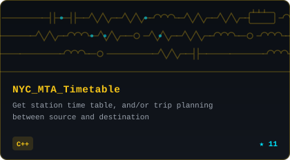</a></td>
<td width="50%" align="center"><a href="https://github.com/itsashishupadhyay/Wireless_Charging-">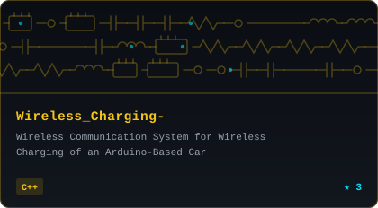</a></td>
</tr>
<tr>
<td width="50%" align="center"><a href="https://github.com/itsashishupadhyay/VisionControlledBionicHand">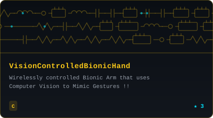</a></td>
<td width="50%" align="center"><a href="https://github.com/itsashishupadhyay/stochastic_market_Stablity_Constrains">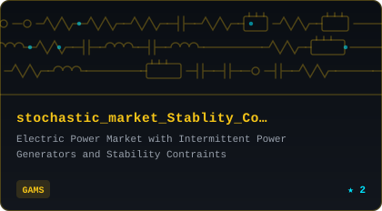</a></td>
</tr>
<tr>
<td width="50%" align="center"><a href="https://github.com/itsashishupadhyay/Smart_Grid">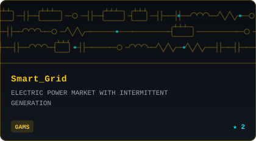</a></td>
<td width="50%" align="center"><a href="https://github.com/itsashishupadhyay/Intruder-Alert-System">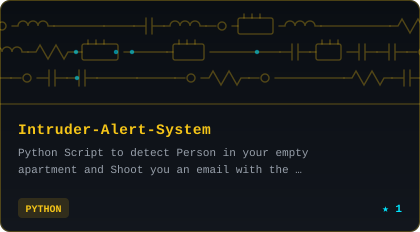</a></td>
</tr>
</table>

<details>
<summary><b>🔍 Expand the full bench — 10 more projects</b></summary>
<br/>

<table>
<tr>
<td width="50%" align="center"><a href="https://github.com/itsashishupadhyay/object_detection_opencv_cpp">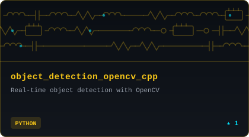</a></td>
<td width="50%" align="center"><a href="https://github.com/itsashishupadhyay/MIPS_Pipeline">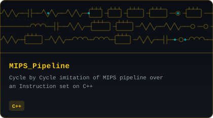</a></td>
</tr>
<tr>
<td width="50%" align="center"><a href="https://github.com/itsashishupadhyay/OpenCv_RockPaperScissor">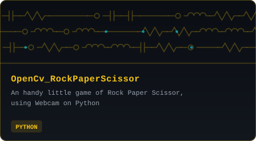</a></td>
<td width="50%" align="center"><a href="https://github.com/itsashishupadhyay/Anagrams_Derived">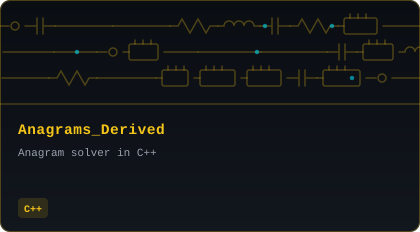</a></td>
</tr>
<tr>
<td width="50%" align="center"><a href="https://github.com/itsashishupadhyay/ESP32-Wireless_Audio">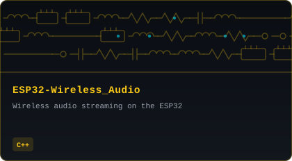</a></td>
<td width="50%" align="center"><a href="https://github.com/itsashishupadhyay/encrypt_decrypt_AES">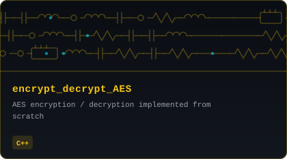</a></td>
</tr>
<tr>
<td width="50%" align="center"><a href="https://github.com/itsashishupadhyay/Hey_Ashish">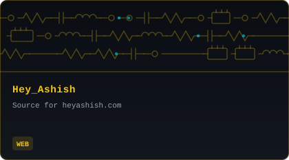</a></td>
<td width="50%" align="center"><a href="https://github.com/itsashishupadhyay/Meta_Smartglasses_Mission_control">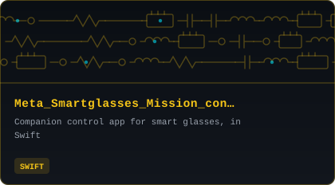</a></td>
</tr>
<tr>
<td width="50%" align="center"><a href="https://github.com/itsashishupadhyay/Space_Navigation">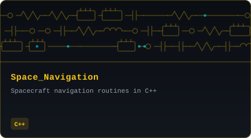</a></td>
<td width="50%" align="center"><a href="https://github.com/itsashishupadhyay/homebrew-mta">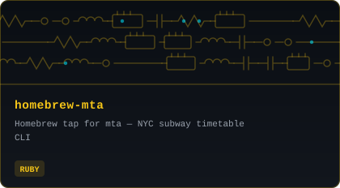</a></td>
</tr>
</table>

Full interactive gallery lives at **[heyashish.com](https://heyashish.com)** — including the button that changes the lights in my actual room. Yes, really.

</details>

<br/>

## 🛠️ THE ARSENAL

<div align="center">

**// SILICON & SIGNALS**


**// CODE & CLOUD**


**// DISCIPLINES**

`Power Optimization` · `SoC Validation` · `Thermal Management` · `Signal Processing` · `RTOS` · `FCC Certification` · `Factory Test Automation` · `ML on the Edge`

</div>

<br/>

## 📜 PUBLISHED & PATENTED

```yaml
2023: "A Localized Compute Platform to Support EVA Software Applications"
      → 52nd Intl. Conference on Environmental Systems (ICES), Calgary        # space suits need compute too
2022: "Wireless Power Transfer Hardware" → Biosensors & Bioelectronics       # neuro-modulation for mice, wirelessly
2020: NSF Award #2031594 → 18 publications, provisional US patent, PCT app   # the tiny-but-mighty era
2019: "Wireless Charging of an Arduino-Based Car" → IEEE CACS, Taiwan        # where it all started
```

<br/>

## 🎛️ MISC. REGISTERS (READ-ONLY)

```c
struct ashish_t {
    char  *current_obsession   = "making AR glasses not cook your temples";
    char  *design_philosophy   = "if it ships, it's real; if it's elegant, it's art";
    float  sleep_priority      = 0.02;          // deprecated, see personal_projects[]
    bool   will_talk_about_pcbs_unprompted = true;
    char  *fun_fact            = "my website has a button that changes my room lights via AWS + IFTTT";
    char  *coffee_state        = VOLATILE;      // do not cache
};
```

<br/>

<div align="center">

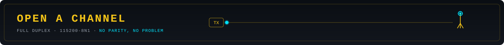

*Have a project in mind? Want to collaborate? Just want to say hi?*

<a href="https://heyashish.com/#contact"></a>
<a href="https://heyashish.com/doc/Ashish_Upadhyay_CV.pdf"></a>

<br/><br/>


<br/>

<sub>⚡ Built with caffeine, solder fumes, and an AI that bills by the token ⚡</sub>


</div>
